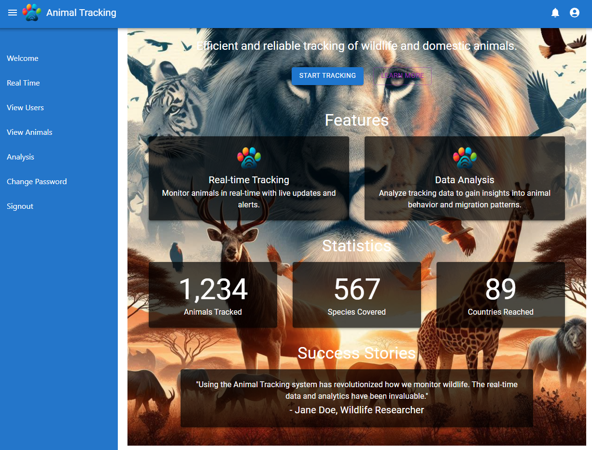
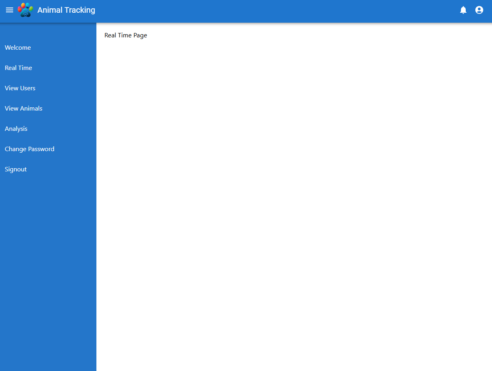

# 🐾 Animal Tracking

Welcome to the Animal Tracking project! This project is designed to help track and manage animal data efficiently. It includes features like real-time tracking, user management, animal data analysis, and more.

## 🚀 Features

- **Welcome Page**: An introduction to the Animal Tracking system.
- **Real-Time Tracking**: Monitor animals in real-time.
- **User Management**: View and manage users.
- **Animal Data**: View and manage animal information.
- **Data Analysis**: Analyze animal data with interactive charts.
- **Change Password**: Update user passwords.
- **Sign Out**: Securely log out of the system.

## 📸 Screenshots

## 🛠 Installation

To get a local copy up and running, follow these simple steps:

1. **Clone the repository**:
   git clone https://github.com/Elisa-Kikota/animal-tracking.git

2. **Navigate to the project directory:**:
    cd animal-tracking

3. **Install dependencies:**
    npm install

4. **Run the application:**
    npm start

## 🧑‍💻 Usage

Once the application is running, navigate to http://localhost:3000 in your web browser. Use the sidebar to navigate through different sections of the application.

## 👥 Contributing
We welcome contributions to the Animal Tracking project. To contribute, follow these steps:

1. Fork the repository.
2. Create a new branch (git checkout -b feature/your-feature-name).
3. Make your changes.
4. Commit your changes (git commit -m 'Add some feature').
5. Push to the branch (git push origin feature/your-feature-name).
6. Open a pull request

## 📝 License
Distributed under the MIT License. See LICENSE for more information.

## 📧 Contact
Elisa Kikota - kikotaelisa@gmail.com

Project Link: https://github.com/Elisa-Kikota/animal-tracking